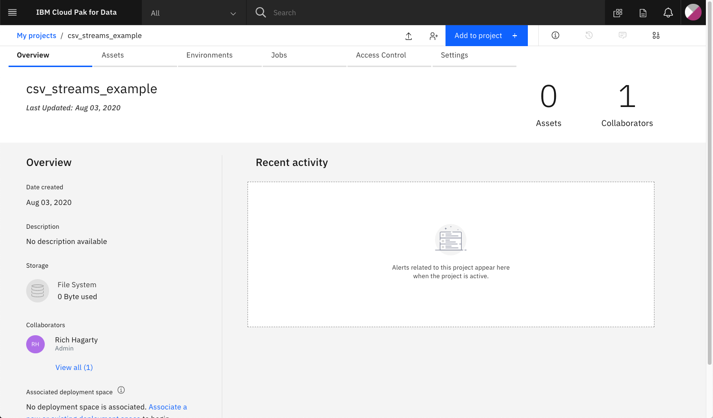

# Create an IBM Streams application using Python API in a Jupyter Notebook

The Python API [streamsx](https://pypi.org/project/streamsx/) allows developers to build streaming applications that are executed using IBM Streams, a service that runs on IBM Cloud Pak for Data. The Cloud Pak for Data platform provides additional support, such as integration with multiple data sources, built-in analytics, Jupyter notebooks, and machine learning. Scalability is increased by distributing processes  across multiple computing resources.

> **NOTE**: The IBM Streams service is also available on IBM Cloud, and has the product name [IBM Streaming Analytics](https://cloud.ibm.com/catalog/services/streaming-analytics).

In this code pattern, we will create a Jupyter notebook that contains Python code that utilizes the `streamsx` API to build a streaming application. The application will process a stream of data containing mouse click events from users as they browse a shopping web site.

Note that the `streamsx` package comes with additional adapters for external systems, such as Kafka, databases, and geospatial analytics, but we will just focus on the core service.

The notebook will cover all of the steps to building a simple IBM Streams  application. This includes:

* Create a `Toplogy` object that will contain the stream.
* Define the `Source` of our data. In this example, we are using click stream data generated from a shopping website.
* Add the data source to a stream.
* Create a `Filter` so that we only see clicks associated with adding items to a shopping cart.
* Create a function that computes the running total cost of the items for each customer. The function is executed every second.
* Results are printed out with the customer ID and the cost of the items in the cart.
* Create a `View` object so that we can see the results of our stream application.
* Use the `Publish` function so that other applications can use our stream.

The application is started by `submitting` the `topology`, which will then create a running `job`. The streams `job` can then be assigned a `View` object that can be used to see the output in real-time.

## Flow


1. User runs Jupyter Notebook in IBM Cloud Pak for Data
1. Clickstream data is inserted into streaming app
1. Streaming app using the `streamsx` Python API is executed in the IBM Streams service
1. User can optionally access the IBM Streams service job to view events

## Incuded components

* [IBM Streams on Cloud Pak for Data](https://www.ibm.com/cloud/streaming-analytics): Development platform for visually creating streaming applications.
* [Jupyter Notebook](https://jupyter.org/): An open source web application that allows you to create and share documents that contain live code, equations, visualizations, and explanatory text.

## Featured technologies

* [Python](https://www.python.org/): Python is a programming language that lets you work more quickly and integrate your systems more effectively.

## Prerequisites

* [IBM Cloud Pak for Data](https://www.ibm.com/in-en/products/cloud-pak-for-data)

## Steps

1. [Clone the repo](#1-clone-the-repo)
1. [Add IBM Streams service to Cloud Pak for Data](#2-add-ibm-streams-service-to-cloud-pak-for-data)
1. [Create a new project in Cloud Pak for Data](#3-create-a-new-project-in-cloud-pak-for-data)
1. [Add a data asset to your project](#4-add-a-data-asset-to-your-project)
1. [Add a notebook to your project](#5-add-a-notebook-to-your-project)
1. [Run the notebook](#6-run-the-notebook)
1. [View job status in Streams service panel](#7-view-job-status-in-streams-service-panel)
1. [Cancel the job](#8-cancel-the-job)

### 1. Clone the repo

```bash
git clone https://github.com/IBM/ibm-streams-with-python-api
```

### 2. Add IBM Streams service to Cloud Pak for Data

Ensure that your administrator has added `IBM Streams` as a service to your `Cloud Pak for Data` instance, and that your user has access to the service.

Once you login to your `Cloud Pak for Data` instance, click on the (☰) `menu` icon in the top left corner of your screen and click `My Instances`.


### 3. Create a new project in Cloud Pak for Data

Once you login to your `Cloud Pak for Data` instance, click on the (☰) `menu` icon in the top left corner of your screen and click `Projects`.

From the Project list, click on `New Project`. Then select `Create an empty project`, and enter a unique name for your project. Click on `Create` to complete your project creation.

Upon a successful project creation, you are taken to the project Overview tab. Take note of the `Assets` tab which we will be using to associate our project with any external assets (datasets and notebooks).



### 4. Add a data asset to your project

From the project `Assets` tab, click `Add to project +` on the top right and choose the `Data` asset type.


Using the `Data` panel on the right, selecte the `Load` tab and click on the `browse` link to select the `clickstream.csv` data file located in the local `data` directory.


>**TIP:** Once added, the data file will appear in the `Data assets` section of the `Assets` tab.

### 5. Add a notebook to your project

From the project `Assets` tab, click `Add to project +` on the top right and choose the `Notebook` asset type.


Fill in the following information:

* Select the `From URL` tab. [1]
* Enter a `Name` for the notebook and optionally a description. [2]
* For `Select runtime` select the `Default Python 3.6` option. [3]
* Under `Notebook URL` provide the following url [4]:

```url
https://raw.githubusercontent.com/IBM/ibm-streams-with-python-api/master/notebooks/clickstream-from-file.ipynb
```


Click the `Create` button.

Your project should now contain two assets.


### 6. Run the notebook

After creation, the notebook will automatically be loaded into the notebook runtime environment. You can re-run the notebook at any time by clicking on the `pencil` edit icon displayed in right-hand column of the notebook row.


When a notebook is executed, what is actually happening is that each code cell in the notebook is executed, in order, from top to bottom.

Each code cell is selectable and is preceded by a tag in the left margin. The tag format is `In [x]:`. Depending on the state of the notebook, the `x` can be:

* A blank, this indicates that the cell has never been executed.
* A number, this number represents the relative order this code step was executed.
* A `*`, this indicates that the cell is currently executing.

There are several ways to execute the code cells in your notebook:

* One cell at a time.
  * Select the cell, and then press the `Play` button in the toolbar.
* Batch mode, in sequential order.
  * From the `Cell` menu bar, there are several options available. For example, you can `Run All` cells in your notebook, or you can `Run All Below`, that will start executing from the first cell under the currently selected cell, and then continue executing all cells that follow.
* At a scheduled time.
  * Press the `Schedule` button located in the top right section of your notebook panel. Here you can schedule your notebook to be executed once at some future time, or repeatedly at your specified interval.

>**NOTE**: An example version of the notebook (shown with output cells) can be found in the `notebooks/with-output` folder of this repo.

The comments in each of the notebook cells helps explain what action is occuring, but let's highlight some of the more important steps.

#### Set IBM Streams instance name

In `Section 1.1`, change `"my-instance"` to the name of your IBM Streams service.


#### Import the CSV data file

In `Section 2.1.2` we import our project data asset to the topolgy so that it is available when the stream application is run.

Ensure that the file name matches your project data asset name.


#### Creating and running the stream application

The notebook covers all of the steps to building a simple streams application. This includes:

* Create a `Topology` object that will contain the stream.
* Define the incoming data source. In this example, we are using click stream data generated from a shopping website.
* Use the incoming data to create a source `Stream`.
* Filter the data on the `Stream` so that we only see clicks associated with adding items to a shopping cart.
* Create a function that computes the running total cost of the items for each customer for the last 30 seconds. The function is executed every second.
* Results are printed out with the customer ID and the cost of the items in the cart.
* Create a `View` object so that we can see the results of our streams application.
* Use the `Publish` function so that other applications can use our stream.

The application is started by `submitting` the `Topology`, which will then create a running job. Once the job is running, you can use the `View` object created earlier to see the running totals as they are calculated.

### 7. View job status in Streams service panel

From the IBM Cloud Pak for Data main menu, click on `My Instances` and then the `Jobs` tab.


Find your job based on name, or use the `JobId` printed in your notebook when you submitted the topology.

Select `View graph` from the context menu action for the running job.


### 8. Cancel the job

In `Section 5` of the notebook, a button is created which you can click to cancel the job.


# License

This code pattern is licensed under the Apache Software License, Version 2.  Separate third party code objects invoked within this code pattern are licensed by their respective providers pursuant to their own separate licenses. Contributions are subject to the [Developer Certificate of Origin, Version 1.1 (DCO)](https://developercertificate.org/) and the [Apache Software License, Version 2](https://www.apache.org/licenses/LICENSE-2.0.txt).

[Apache Software License (ASL) FAQ](https://www.apache.org/foundation/license-faq.html#WhatDoesItMEAN)
